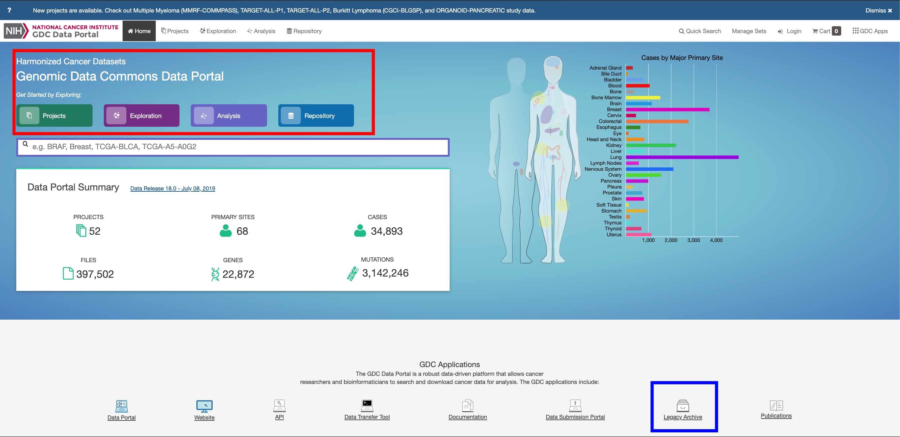
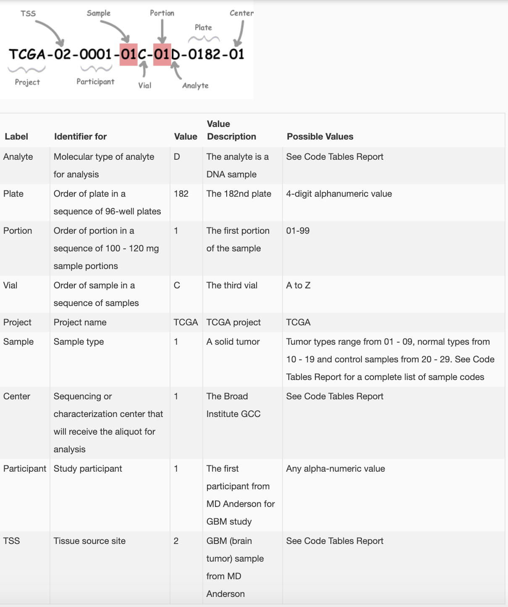
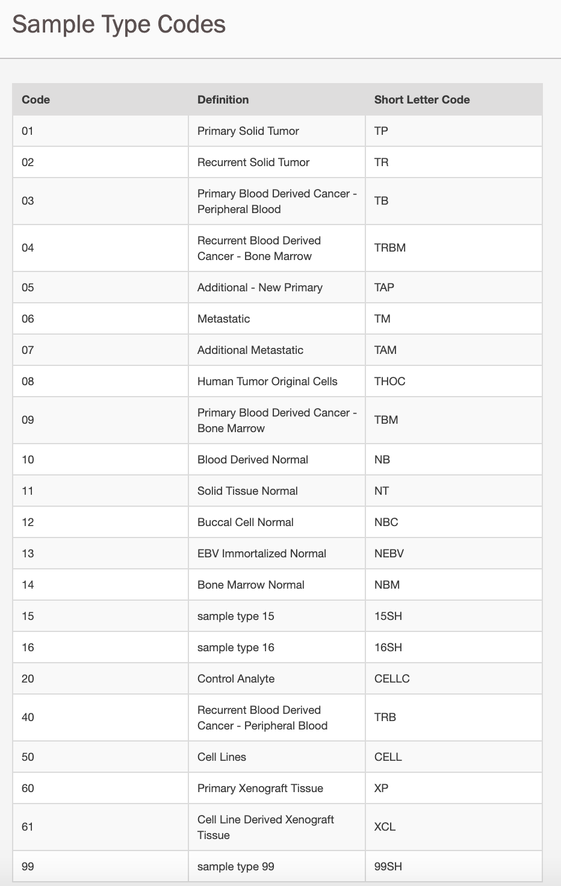
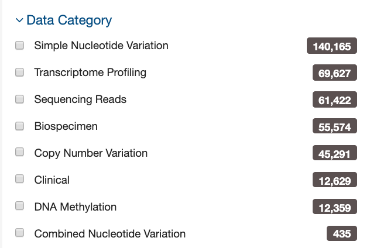
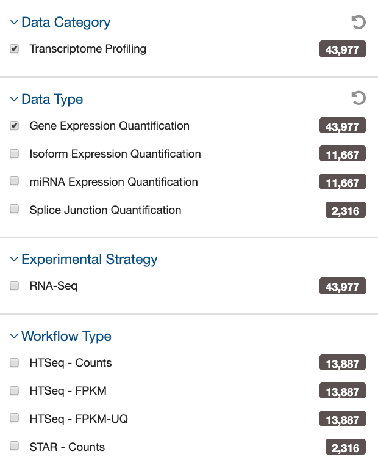
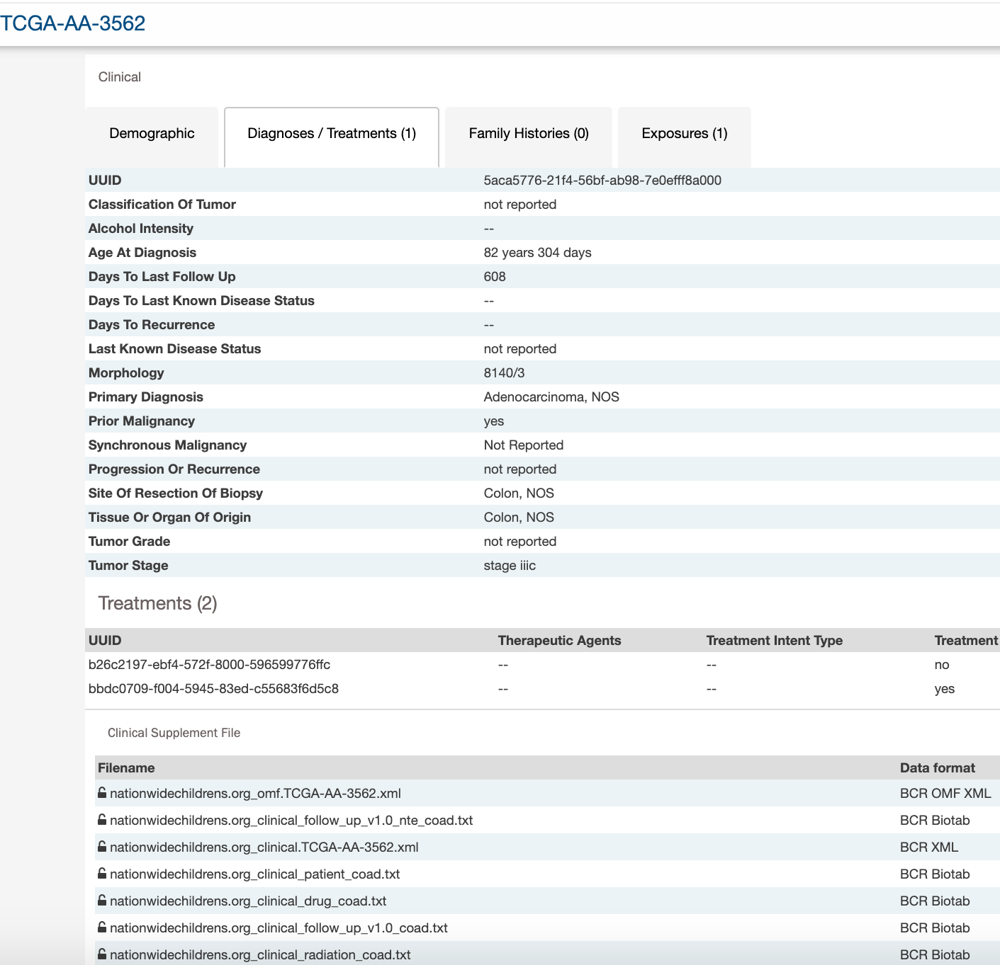
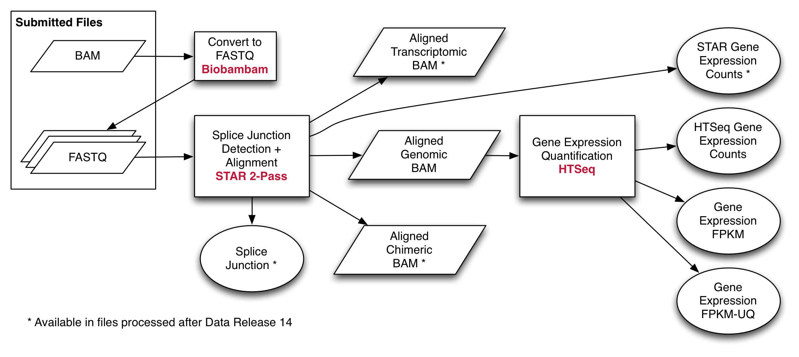
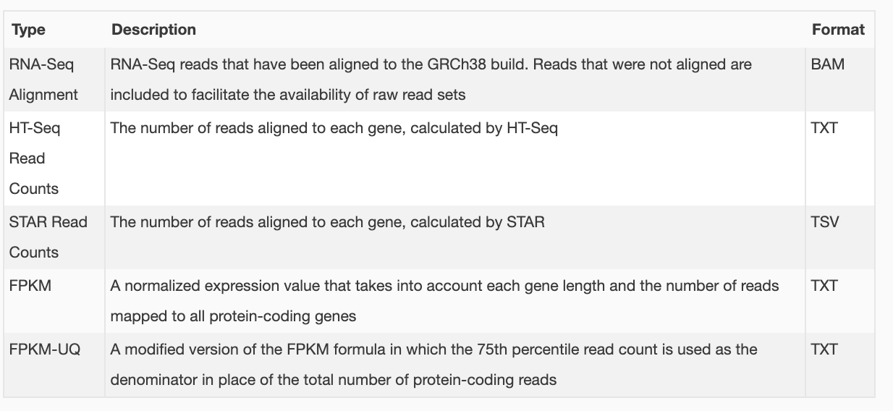

```{r setup, include=FALSE}
knitr::opts_chunk$set(dpi = 300)
```

<style>
div.blue { background-color:#e6f0ff; border-radius: 5px; padding: 20px;}

 body {text-align: justify}
p.caption {
  font-size: 0.9em;
  font-style: italic;
  color: grey;
  margin-right: 10%;
  margin-left: 10%;  
  text-align: justify;
}
</style>


# Instructor names and contact information

1. Benjamin P. Berman (Benjamin.Berman at cshs.org)
2. Tiago C. Silva (tiagochst at gmail.com)

# Workshop description

## Aims

This workshop will:

1. Introduce you to the TCGA (The Cancer Genome Atlas) data available at the NCI's Genomic Data Commons (GDC).
2. Demonstrate how to access and import TCGA data using the R/Bioconductor package TCGAbiolinks [@colaprico2015tcgabiolinks]. 
3. Provide instruction to visualize copy number alteration and mutation data using the R/Bioconductor package maftools.


## Useful links 

- the NCI's Genomic Data Commons (GDC): https://gdc.cancer.gov/.
- TCGAbiolinks package: http://bioconductor.org/packages/TCGAbiolinks/
- maftools package: http://bioconductor.org/packages/maftools/

## Reference articles 

- TCGAbiolinks:
  - Colaprico, Antonio, et al. “TCGAbiolinks: an R/Bioconductor package for integrative analysis of TCGA data.” Nucleic acids research 44.8 (2015): e71-e71.
Silva, Tiago C., et al. “TCGA Workflow: Analyze cancer genomics and epigenomics data using Bioconductor packages.” F1000Research 5 (2016). (https://f1000research.com/articles/5-1542/v2)
  - Mounir, Mohamed, et al. “New functionalities in the TCGAbiolinks package for the study and integration of cancer data from GDC and GTEx.” PLoS computational biology 15.3 (2019): e1006701. (https://doi.org/10.1371/journal.pcbi.1006701)
  -  Silva TC, Colaprico A, Olsen C et al.TCGA Workflow: Analyze cancer genomics and epigenomics data using Bioconductor packages [version 2; peer review: 1 approved, 2 approved with reservations]. F1000Research 2016, 5:1542
(https://doi.org/10.12688/f1000research.8923.2). 

- The NCI's Genomic Data Commons (GDC):
  - Gao, Galen F., et al. “Before and After: Comparison of Legacy and Harmonized TCGA Genomic Data Commons’ Data.” Cell systems 9.1 (2019): 24-34. (https://doi.org/10.1016/j.cels.2019.06.006)

- Maftools:
  - Mayakonda A, Lin D, Assenov Y, Plass C, Koeffler PH (2018). “Maftools: efficient and comprehensive analysis of somatic variants in cancer.” Genome Research. doi: 10.1101/gr.239244.118.

- Complexheatmap:
  - Gu Z, Eils R, Schlesner M (2016). “Complex heatmaps reveal patterns and correlations in multidimensional genomic data.” Bioinformatics.

##  R/Bioconductor packages used

* [TCGAbiolinks](http://bioconductor.org/packages/TCGAbiolinks/)
* [MultiAssayExperiment](http://bioconductor.org/packages/MultiAssayExperiment/)
* [maftools](http://bioconductor.org/packages/maftools/)
* [ComplexHeatmap](http://bioconductor.org/packages/ComplexHeatmap/)

## Pre-requisites

* Basic knowledge of R syntax
* Understand the pipe operator ("%>%") (help material https://r4ds.had.co.nz/pipes.html)
* Understand the SummarizedExperiment data structure (help material 	http://bioconductor.org/packages/SummarizedExperiment/)

# Introduction

## Understanding GDC (genomics data common portal)

In this workshop we will access (The Cancer Genome Atlas) data available at the NCI's Genomic Data Commons (GDC).
Before we start, it is important to know that the data is deposit in two different databases: 

- The legacy archive (https://portal.gdc.cancer.gov/legacy-archive/search/f) which contains unharmonized legacy data from repositories that predate the GDC (e.g. CGHub). Also, legacy data is not actively maintained, processed, or harmonized by the GDC (Source: https://docs.gdc.cancer.gov/Data_Portal/Users_Guide/Legacy_Archive/)

- Harmonized database (https://portal.gdc.cancer.gov/) which contains data from many cancer projects processed using standardized pipelines and the reference genome GRCh38 (hg38). This gives the advantage of analyzing multiple cancer types or the same cancer type across multiple projects. You can find more information about the pipelines supporting data harmonization at https://gdc.cancer.gov/about-data/gdc-data-harmonization and at https://docs.gdc.cancer.gov/Encyclopedia/pages/Harmonized_Data/.

An overview of the web portal is available at https://docs.gdc.cancer.gov/Data_Portal/Users_Guide/Getting_Started/.

Also, a more in-depth comparison between the legacy and Harmonized data was recently published:

  - Gao, Galen F., et al. “Before and After: Comparison of Legacy and Harmonized TCGA Genomic Data Commons’ Data.” Cell systems 9.1 (2019): 24-34. (https://doi.org/10.1016/j.cels.2019.06.006)




## Understanding TCGA data

### Data access

GDC provides the data with two access levels:

- Open: includes high level genomic data that is not individually identifiable, as well as most clinical and all biospecimen data elements.
- Controlled: includes individually identifiable data such as low-level genomic sequencing data, germline variants, SNP6 genotype data, and certain clinical data elements 

You can find more information about those two levels and how to get access to controlled data at: https://gdc.cancer.gov/access-data/data-access-processes-and-tools.

### TCGA barcode description

Each TCGA sample has a unique identifier called TCGA barcode, which contains important information about each sample. 
A description of the barcode is shown below (Source: https://docs.gdc.cancer.gov/Encyclopedia/pages/TCGA_Barcode/).



You can find a table with all the code and meanings at https://gdc.cancer.gov/resources-tcga-users/tcga-code-tables.
The Sample Type Codes is shown below:



### Data structure

In order to filter the data available in GDC some fields are available such as project (TCGA, TARGET, etc.), data category (Transcriptome Profiling, DNA methylation, Clinical, etc.), data type (Gene Expression Quantification, Isoform Expression Quantification, Methylation Beta Value, etc.), experimental strategy (miRNA-Seq, RNA-Seq, etc.), Workflow Type, platform, access type and others.




In terms of data granularity, a project has data on several categories, each category contains several data types that might have been produced with different workflows, experimental strategy and platforms. In that way, if you select data type "Gene Expression Quantification" the data category will be Transcriptome Profiling.



You can find the entry possibilities for each filter at the repository page of the database at https://portal.gdc.cancer.gov/repository.

## The SummarizedExperiment data structure

Before we start, it is important to know that the R/Bioconductor environment provides a data structure called `SummarizedExperiment`, which was created to handle both samples metadata (age, gender, etc), genomics data (i.e. DNA methylation beta value) and genomics metadata information (chr, start, end, gene symbol) in the same object.
You can access samples metadata with `colData` function, genomics data with `assays` and genomics metadata with `rowRanges`.


## Loading required packages

```{r, message=FALSE}
library(TCGAbiolinks)
library(MultiAssayExperiment)
library(maftools)
library(dplyr)
library(ComplexHeatmap)
```

In case those packages are not available, you can install those packages using BiocManager.
```{eval = FALSE}
if (!requireNamespace("BiocManager", quietly = TRUE))
    install.packages("BiocManager")

if (!requireNamespace("ComplexHeatmap", quietly = TRUE))
  BiocManager::install("ComplexHeatmap") # from bioconductor

if (!requireNamespace("TCGAbiolinks", quietly = TRUE))
  BiocManager::install("BioinformaticsFMRP/TCGAbiolinks") # from github
```

# Working with TCGA data


During this workshop we will be using open access data from the harmonized GDC database (hg38 version), which can be accessed 
at https://portal.gdc.cancer.gov/.

Through the next sections we will:

1. Access TCGA clinical data
2. Search, download and make an R object from TCGA data
 - RNA-seq data
 - DNA methylation
3. Download samples metadata
4. Download and visualize mutations
5. Download and visualize copy number alterations 


## Clinical data

In GDC database the clinical data can be retrieved from different sources:

- indexed clinical: a refined clinical data that is created using the XML files.
- XML files: original source of the data
- BCR Biotab: tsv files parsed from XML files


There are two main differences between the indexed clinical and XML files:

- XML has more information: radiation, drugs information, follow-ups, biospecimen, etc.
So, the indexed one is only a subset of the XML files
- The indexed data contains the updated data with the follow up information. 
For example: if the patient was alive when the clinical data was collect and then in the next follow-up he is dead, 
the indexed data will show dead. 
The XML will have two fields, one for the first time saying he is alive (in the clinical part) and the follow-up saying he is dead.

Other useful clinical information available are:

* Tissue slide image 
* Pathology report - Slide image

You can check examples in TCGAbiolinks vignette at https://bioconductor.org/packages/release/bioc/vignettes/TCGAbiolinks/inst/doc/clinical.html.




```{R, eval = TRUE}
# Access indexed clinical data
clinical <- GDCquery_clinic("TCGA-COAD")
head(clinical)
```

The clinical indexed data is the same you can see in the GDC data portal. Observation: the GDC API provides **age_at_diagnosis** in days.

```{R, eval = TRUE}
# Same case as figure above
clinical %>% 
  dplyr::filter(submitter_id == "TCGA-AA-3562") %>% 
  t %>% 
  as.data.frame
```

You can also access Biotab files which are TSV files created from the XML files
(only works for TCGAbiolinks version higher than 2.13.5).

```{R message=FALSE, warning=FALSE, results='hide', fig.keep='all', fig.height = 10, fig.width = 10, cache = TRUE}
query <- GDCquery(project = "TCGA-ACC", 
                  data.category = "Clinical",
                  data.type = "Clinical Supplement", 
                  data.format = "BCR Biotab")
GDCdownload(query)
clinical.BCRtab.all <- GDCprepare(query)
```

```{R}
names(clinical.BCRtab.all)
```

```{r echo = TRUE, message = FALSE, warning = FALSE}
clinical.BCRtab.all$clinical_drug_acc  %>% 
  head  %>% 
  as.data.frame
```

## RNA-Seq data

The RNA-Seq pipeline produces raw counts, FPKM and FPKM-UQ quantifications and is described
at https://docs.gdc.cancer.gov/Data/Bioinformatics_Pipelines/Expression_mRNA_Pipeline/.







The following options are used to search mRNA results using TCGAbiolinks:

- data.category: "Transcriptome Profiling"
- data.type: "Gene Expression Quantification"
- workflow.type: "HTSeq - Counts", "HTSeq - FPKM", "HTSeq - FPKM-UQ"

Here is the example to download the raw counts, which can be used with DESeq2 (http://bioconductor.org/packages/DESeq2/) for differential expression analysis.

```{R message=FALSE, warning=FALSE, results='hide', fig.keep='all', fig.height = 10, fig.width = 10, cache = TRUE}
query.exp.hg38 <- GDCquery(project = "TCGA-GBM", 
                  data.category = "Transcriptome Profiling", 
                  data.type = "Gene Expression Quantification", 
                  workflow.type = "HTSeq - Counts",
                  barcode =  c("TCGA-14-0736-02A-01R-2005-01", "TCGA-06-0211-02A-02R-2005-01"))
GDCdownload(query.exp.hg38)
raw.counts <- GDCprepare(query = query.exp.hg38, summarizedExperiment = FALSE)
```

```{R}
head(raw.counts)
```

Here is the example to download the FPKM-UQ counts.

```{R message=FALSE, warning=FALSE, results='hide', fig.keep='all', fig.height = 10, fig.width = 10, cache = TRUE}
query.exp.hg38 <- GDCquery(project = "TCGA-GBM", 
                  data.category = "Transcriptome Profiling", 
                  data.type = "Gene Expression Quantification", 
                  workflow.type = "HTSeq - FPKM-UQ",
                  barcode =  c("TCGA-14-0736-02A-01R-2005-01", "TCGA-06-0211-02A-02R-2005-01"))
GDCdownload(query.exp.hg38)
fpkm.uq.counts <- GDCprepare(query = query.exp.hg38, summarizedExperiment = FALSE)
```

```{R}
head(fpkm.uq.counts)
```


## Mutation

**TCGAbiolinks** has provided a few functions to download mutation data from GDC.
There are two options to download the data:

1. Use `GDCquery_Maf` which will download MAF aligned against hg38.

This example will download MAF (mutation annotation files) for variant calling pipeline muse.
Pipelines options are: `muse`, `varscan2`, `somaticsniper`, `mutect`. For more information please access
[GDC docs](https://docs.gdc.cancer.gov/Data/Bioinformatics_Pipelines/DNA_Seq_Variant_Calling_Pipeline/).


You can download the data using TCGAbiolinks `GDCquery_Maf` function. 
```{R GDCquery_Maf, eval = TRUE, cache = TRUE, message=FALSE, warning=FALSE, results='hide', fig.keep='all', fig.height = 10, fig.width = 10}
# GDCquery_Maf download the data from GDC
maf <- GDCquery_Maf("COAD", pipelines = "muse")
```

```{R}
maf %>% head %>% as.data.frame
```

Then visualize the results using the maftools package.

```{R  maftools, eval = TRUE, cache = TRUE, message=FALSE, warning=FALSE, results='hide', fig.keep='all', fig.height = 10, fig.width = 10}
# using maftools for data summary 
maftools.input <- maf %>% read.maf

# Check summary
plotmafSummary(maf = maftools.input, 
               rmOutlier = TRUE, 
               addStat = 'median', 
               dashboard = TRUE)

oncoplot(maf = maftools.input, 
         top = 10, 
         removeNonMutated = TRUE)

# classifies Single Nucleotide Variants into Transitions and Transversions
titv = titv(maf = maftools.input, 
            plot = FALSE, 
            useSyn = TRUE)
plotTiTv(res = titv)
```

You can extract sample summary from MAF object.

```{R}
getSampleSummary(maftools.input)
```

## Copy number alteration data

The Copy Number Variation Analysis Pipeline is described at https://docs.gdc.cancer.gov/Data/Bioinformatics_Pipelines/CNV_Pipeline/

Numeric focal-level Copy Number Variation (CNV) values were generated with "Masked Copy Number Segment" files from tumor aliquots using GISTIC2 on a project level. Only protein-coding genes were kept, and their numeric CNV values were further thresholded by a noise cutoff of 0.3:

- Genes with focal CNV values smaller than -0.3 are categorized as a "loss" (-1)
- Genes with focal CNV values larger than 0.3 are categorized as a "gain" (+1)
- Genes with focal CNV values between and including -0.3 and 0.3 are categorized as "neutral" (0).


You can access "Gene Level Copy Number Scores" from GISTIC with the code below:
```{R gistic, message=FALSE, cache = TRUE, warning=FALSE, results='hide', fig.keep='all', fig.height = 10, fig.width = 10}
query <- GDCquery(project = "TCGA-GBM",
             data.category = "Copy Number Variation",
             data.type = "Gene Level Copy Number Scores",              
             access = "open")
GDCdownload(query)
scores <- GDCprepare(query)
```

```{R warning = FALSE,fig.height = 10, fig.width = 10}
scores[1:5,1:5]
```

You can visualize the data using the R/Bioconductor package complexHeatmap. 
```{R gisticheatmap, message=FALSE, warning=FALSE, results='hide', fig.keep='all', fig.height = 10, fig.width = 10}
scores.matrix <- scores %>% 
  dplyr::select(-c(1:3)) %>%  # Removes metadata from the first 3 columns
  as.matrix

rownames(scores.matrix) <- paste0(scores$`Gene Symbol`,"_",scores$Cytoband)

# gain in more than 100 samples
gain.more.than.hundred.samples <- which(rowSums(scores.matrix == 1) > 100)

# loss in more than 100 samples
loss.more.than.hundred.samples <- which(rowSums(scores.matrix == -1) > 100)

lines.selected <- c(gain.more.than.hundred.samples,loss.more.than.hundred.samples)

Heatmap(scores.matrix[lines.selected,],
        show_column_names = FALSE, 
        show_row_names = TRUE,
         row_names_gp = gpar(fontsize = 8),
        col = circlize::colorRamp2(c(-1,0,1), colors = c("red","white","blue")))

```


## DNA methylation data

The processed DNA methylation data measure the level of methylation at known CpG sites as beta values, calculated from array intensities (Level 2 data) as Beta = $M/(M+U)$ [@zhou2017comprehensive] which ranges from 0 being unmethylated and 1 fully methylated. 

More information about the DNA methylation pipeline is available at https://docs.gdc.cancer.gov/Data/Bioinformatics_Pipelines/Methylation_LO_Pipeline/.


We will download two Glioblastoma (GBM) as a summarizedExperiment object. 
```{R message=FALSE, cache = TRUE, warning=FALSE, results='hide', fig.keep='all', fig.height = 10, fig.width = 10}
query_met.hg38 <- GDCquery(project = "TCGA-GBM", 
                           data.category = "DNA Methylation", 
                           platform = "Illumina Human Methylation 27", 
                           barcode = c("TCGA-02-0116-01A","TCGA-14-3477-01A-01D"))
GDCdownload(query_met.hg38)
data.hg38 <- GDCprepare(query_met.hg38,summarizedExperiment = TRUE)
```

```{R}
data.hg38
```

You can access the probes information with `rowRanges`.
```{R}
data.hg38 %>% rowRanges %>% as.data.frame
```

You can access the samples metadata with `colData`.
```{R}
data.hg38 %>% colData %>% as.data.frame
```
You can access the DNA methylation levels with `assay`.
```{R}
data.hg38 %>% assay %>% head %>% as.data.frame
```

```{R}
# plot 10 most variable probes
data.hg38 %>% 
  assay %>% 
  rowVars %>% 
  order(decreasing = TRUE) %>% 
  head(10) -> idx

pal_methylation <- colorRampPalette(c("#000436",
                                      "#021EA9",
                                      "#1632FB",
                                      "#6E34FC",
                                      "#C732D5",
                                      "#FD619D",
                                      "#FF9965",
                                      "#FFD32B",
                                      "#FFFC5A"))(100)

Heatmap(assay(data.hg38)[idx,],
        show_column_names = TRUE, 
        show_row_names = TRUE,
         name = "Methylation Beta-value", 
         row_names_gp = gpar(fontsize = 8),
         column_names_gp = gpar(fontsize = 8),
        col = circlize::colorRamp2(seq(0, 1, by = 1/99), pal_methylation))
```

## ATAC-Seq data

Please, check our ATAC-seq Workshop: http://rpubs.com/tiagochst/atac_seq_workshop

# Session information
```{r}
sessionInfo()
```

# Workshop materials

## Source code

All source code used to produce the workshops are available at https://github.com/tiagochst/ELMER_workshop_2019.

## Workshops HTMLs

* ELMER data Workshop HTML: http://rpubs.com/tiagochst/elmer-data-workshop-2019
* ELMER analysis Workshop HTML: http://rpubs.com/tiagochst/ELMER_workshop
* ATAC-seq Workshop HTML: http://rpubs.com/tiagochst/atac_seq_workshop


## Workshop videos

We have a set of recorded videos, explaining some of the workshops.

* All videos playlist: https://www.youtube.com/playlist?list=PLoDzAKMJh15kNpCSIxpSuZgksZbJNfmMt
* ELMER algorithm: https://youtu.be/PzC31K9vfu0
* ELMER data: https://youtu.be/R00wG--tGo8
* ELMER analysis part1: https://youtu.be/bcd4uyxrZCw
* ELMER analysis part2: https://youtu.be/vcJ_DSCt4Mo
* ELMER summarizing several analyses: https://youtu.be/moLeik7JjLk
* ATAC-Seq workshop: https://youtu.be/3ftZecz0lU4


```{R, eval = FALSE, include = FALSE}
# miRNA
library(TCGAbiolinks)
query.mirna <- GDCquery(project = "TARGET-AML", 
                        experimental.strategy = "miRNA-Seq",
                        data.category = "Transcriptome Profiling", 
                        barcode = c("TARGET-20-PATDNN","TARGET-20-PAPUNR"),
                        data.type = "miRNA Expression Quantification")
GDCdownload(query.mirna)
mirna <- GDCprepare(query = query.mirna,
                     save = TRUE, 
                     save.filename = "mirna.rda")


query.isoform <- GDCquery(project = "TARGET-AML", 
                          experimental.strategy = "miRNA-Seq",
                          data.category = "Transcriptome Profiling", 
                          barcode = c("TARGET-20-PATDNN","TARGET-20-PAPUNR"),
                          data.type = "Isoform Expression Quantification")
GDCdownload(query.isoform)

isoform <- GDCprepare(query = query.isoform,
                    save = TRUE, 
                    save.filename = "mirna-isoform.rda")
```


# References
